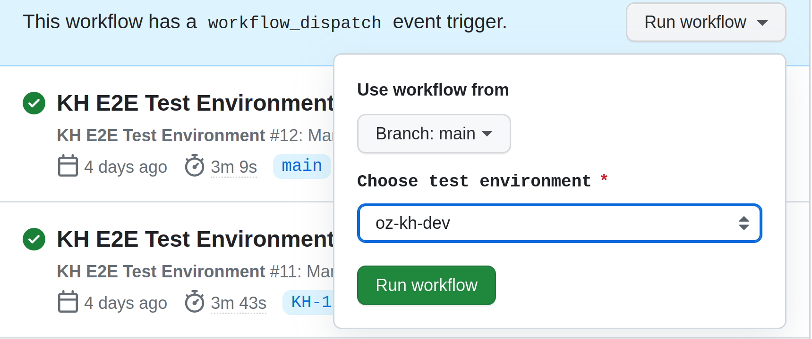

# Ozone KH E2E Test Suite

[](https://github.com/mekomsolutions/ozone-e2e-kh/actions/workflows/e2e.yml)

Welcome to Ozone KH automated test suite.

- [Setup Steps](#setup-steps)
  * [Step 1. Setup the project](#step-1-setup-the-project)
  * [Step 2. Run Ozone KH e2e tests](#step-2-run-ozone-kh-e2e-tests)
- [Configurations](#configurations)
- [Project Structure](#project-structure)
- [Guide for writing tests](#guide-for-writing-tests)
- [GitHub Actions integration](#github-actions-integration)

<small><i><a href='http://ecotrust-canada.github.io/markdown-toc/'>(Table of contents generated with markdown-toc)</a></i></small>

## Setup Steps

### Step 1. Setup the project

Clone the project

```sh
git clone https://github.com/mekomsolutions/ozone-e2e-kh
```
Navigate into the project

```sh
cd ozone-e2e-kh
```

Install dependencies
```sh
yarn install
```

### Step 2. Run Ozone KH e2e tests

```sh
npm run khE2ETests
```
## Configurations

This is underdevelopement/WIP. At the moment, there exists a git-shared
`.env` file used for configuring environment variables.

By default, the test suite will run against the dev server.
You can override it by changing the `E2E_BASE_URL` environment variable beforehand:

```sh
# Ex: Set the server URL here
export E2E_BASE_URL=https://oz-kh-dev.mekomsolutions.net
```

## Project Structure
The project uses the Playwright test runner and,
generally, follows a very simple project structure:

```
e2e
|__ tests
|   ^ Contains test cases
|__ utils
|   ^ Contains utilities needed to setup and tear down
|     tests as well as methods required by the tests to run
```

## Guide for writing tests

When writing a new test case, create a spec in `./e2e/tests`

## GitHub Actions integration
The e2e.yml workflow is made up of one job that runs upon _Git pull requests_ and the other upon _Git push(es)_.

The runE2ETestsOnProvidedEnv.yml workflow is made up of one job that allows selection of a preferred environment at runtime. Note: You need to select the preferred environment to run the tests.


